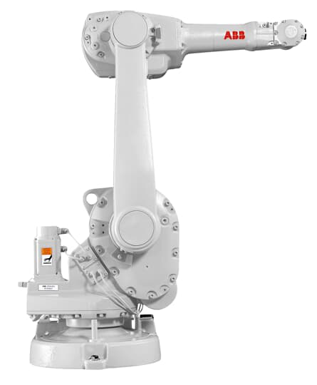

# Kinematics_ABB_1600
Forward Kinematics and Inverse Kinematics of ABB 1600 robot using Matlab
# Robot Arm Control GUI

## Overview

This repository contains a MATLAB-based graphical user interface (GUI) for controlling a robot arm. The GUI allows users to interact with the robot arm, input joint angles, and visualize the robot's forward kinematics.

## Features

- **Forward Kinematics:** The GUI can calculate and display the forward kinematics of the robot arm based on user-provided joint angles. It updates the GUI to display the calculated end-effector position (X, Y, Z).

- **Singleton GUI:** The GUI is designed as a singleton, ensuring that only one instance can run at a time.

- **Potential for Inverse Kinematics:** The code includes placeholders for handling inverse kinematics, allowing for future implementation.

## Getting Started

1. Clone this repository to your local machine.

2. Open the MATLAB GUI by running the `gui.fig` file.

3. Interact with the GUI by entering joint angles and clicking the "Forward Kinematics" button to calculate and display the end-effector position.

## Dependencies

- MATLAB with the Robotics Toolbox (SerialLink)

## Usage

- Run the GUI in MATLAB and follow the on-screen instructions to input joint angles and visualize the robot arm's forward kinematics.

## Contributing

Contributions are welcome! If you'd like to contribute to this project, please fork the repository and create a pull request with your changes.

## License

This project is licensed under the [MIT License](LICENSE).

## Acknowledgments

- The robot arm model and code structure are inspired by robotics and control systems principles.
